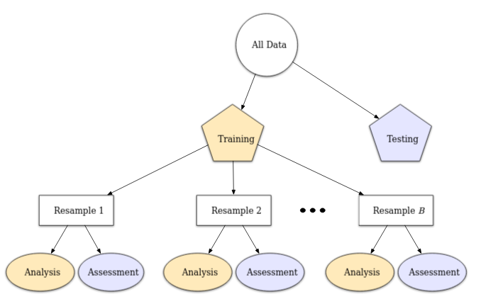

```{r setup, include=FALSE}
knitr::opts_chunk$set(echo = TRUE)
```

# Vocabulary

***

- **Null Hypothesis** (for this problem): The customer does **NOT** contribute to customer churn.
- **TP: True Positive**. Correctly guess that the customer does **NOT** contribute to churn.
- **FP: False Positive**. Incorrectly guess that the customer does **NOT** contribute to churn.
- **TN: True Negative**. Correctly guess that the customer **DOES** contribute to churn.
- **FN: False Negative**. Incorrectly guess that the customer **DOES** contribute to churn.

\[Accuracy = \frac{TP + TN}{TP + FP + TN + FN} = \frac{\text{True outcomes}}{\text{All outcomes}}\]

\[Sensitivity = Recall = \frac{TP}{TP + FN}\]

\[Specificity = \frac{TN}{TN + FP}\]

\[Precision = \frac{TP}{TP + FP} = \frac{TP}{\text{All positives}}\]

- **Precision**: Only care about the positives. This gives us the ratio of when the model correctly agrees with the null hypotheses over the total number of times it agreed with the null hypotheses which includes false positives (FP).  

- **Sensitivity or Recall**: The measure of the model correctly identifying **true positives**. For all customers who don't contribute to customer churn, recall shows how many were correctly identified as such. This factors in **false negatives** as those are customers who don't contribute to churn but aren't identified as such.

\[\text{F1 Score} = 2 \cdot \frac{ \text{Precision} \cdot \text{Recall} }{ \text{Precision} + \text{Recall} }\]

- **F1 Score**: This is the harmonic mean of **precision** and **recall**. This is useful when you want a balance of the two values. 

- **ROC Curves**: The plot between the True Positive Rate (**TPR**) as the dependent variable (y-axis) and False Positive Rate (**FPR**) as the independent variable (x-axis).

# General Notes

***

- Precision-Recall trade-off: High recall is about minimizing Type I error, whereas precision is about minimizing Type II error. Trying to minimize Type I error funnily enough results in an increase of Type II error and vice versa. Deciding which to prioritize, or how to balance them, depends on the problem being solved. When shooting for a balance, use an **F1 Score**.

## Resampling Methods

Re-sampling is a really clever trick that is similar to the train/test split, but for the train set itself! We re-sample the training set any number of times, and each of those re-samples is split into an **analysis** and **assessment** data set.

**Re-sampling is only conducted on the training set**

- The model is fit with the **analysis set**.

- The model is evaluated with the **assessment set**. 

The final estimate of performance for a model is the average of all of the models fit for the re-sampling.



### Cross-Validation

Most common is **V-fold cross-validation**. The data are randomly partitioned into $V$ sets of roughly equal size. 

# Hyperlinks

***

[Tidy Modeling with R](https://www.tmwr.org/)

[Modern Data Science with R](https://mdsr-book.github.io/mdsr2e/ch-modeling.html)

[Precision vs. Recall](https://www.analyticsvidhya.com/blog/2020/09/precision-recall-machine-learning/)

[Bias and Variance](https://www.analyticsvidhya.com/blog/2020/08/bias-and-variance-tradeoff-machine-learning/?utm_source=blog&utm_medium=precision_and_recall)

[Metrics of Classification Models](https://medium.com/analytics-vidhya/how-to-select-performance-metrics-for-classification-models-c847fe6b1ea3)

[Classification model guide](https://www.kirenz.com/post/2021-02-17-r-classification-tidymodels/)

[Themis package for unbalanced data](https://themis.tidymodels.org/index.html)

[Tidymodels Tuning Chapter](https://www.tidymodels.org/start/tuning/)